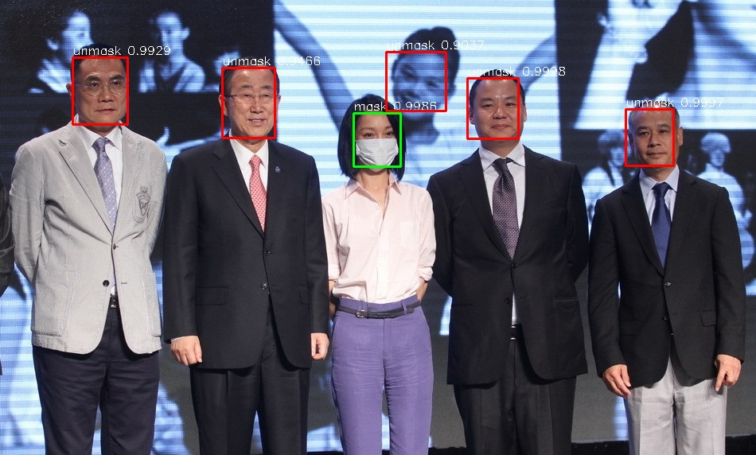
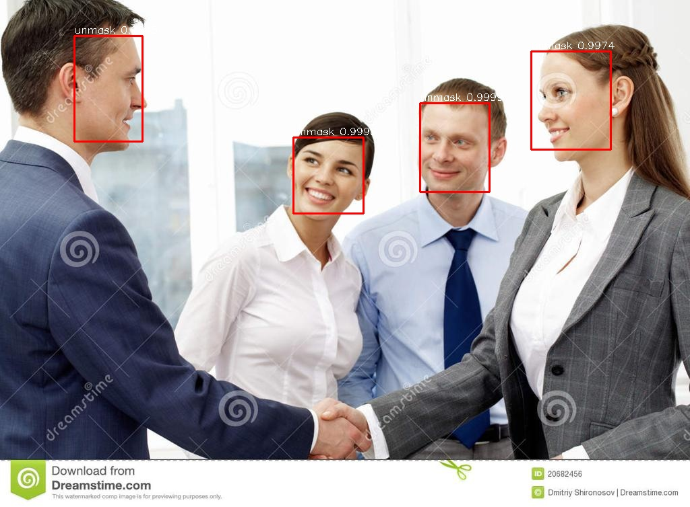

# Face mask detection


This model is a lightweight face mask detection model. Based on ssd, the backbone is Mobilenet and RFB.
 
## Usage

### Installation

Create a new python virtual environment, run `pip install -r requirements.txt`

### Inference

+ Run on video

  ```bash
  python inference.py  --model_path checkpoints/ --camera True
  or
  python inference.py  --model_path checkpoints/*.h5 --camera True
  ```

+ Run on Image

  ```bash
  python inference.py  --model_path checkpoints/ --img_path assets/1_Handshaking_Handshaking_1_71.jpg
  ```

  

  
